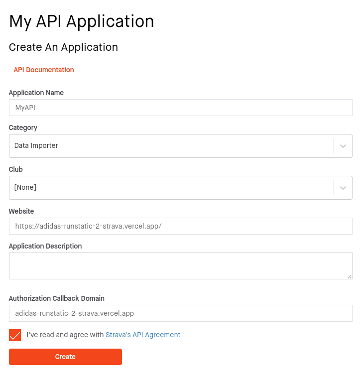
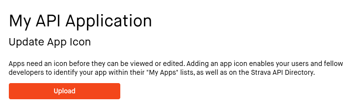
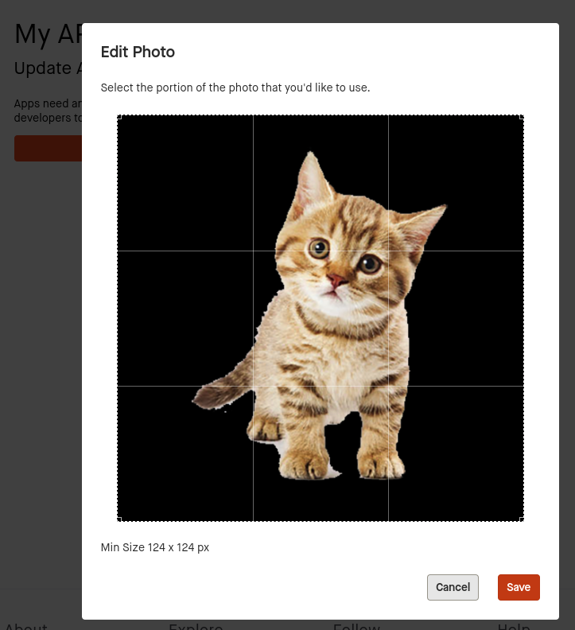
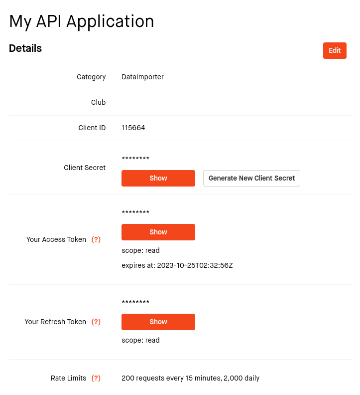

 

<h1 align='center'>Adidas Runstatic 2 Strava App</h1>

# Description

This app allows you to upload your logs received from the _Adidas Runstatic_ app to your _Strava_ account, with just a few clicks.

<a href="https://adidas-runstatic-2-strava.vercel.app/" ><strong>Access the app here!</strong></a>

# Instructions

1. Go to the **Adidas Runstatic** webpage, Login into your account, and ask for a data export (it may take some days to receive it on your email);
2. Extract the file received from Adidas, and check this directory:

    > root/Sport-sessions/GPS-data/

    You should see a list of _.json_ and _.gpx_ files.

3. Access <a href="https://developers.strava.com/">https://developers.strava.com/</a> and click on **Create & Manage Your App**. You will be redirected to a form:

    

4. You may need to update your App Icon. A kitty picture is not mandatory, but highly recommended:

5. After the APP creation, you will receive some credentials:

6. Now go to the <a href="https://adidas-runstatic-2-strava.vercel.app/" >app</a>, and follow the steps.
